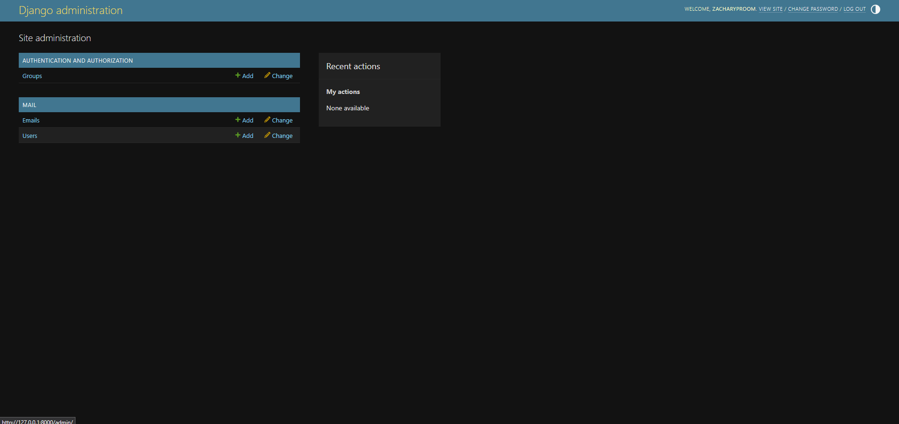
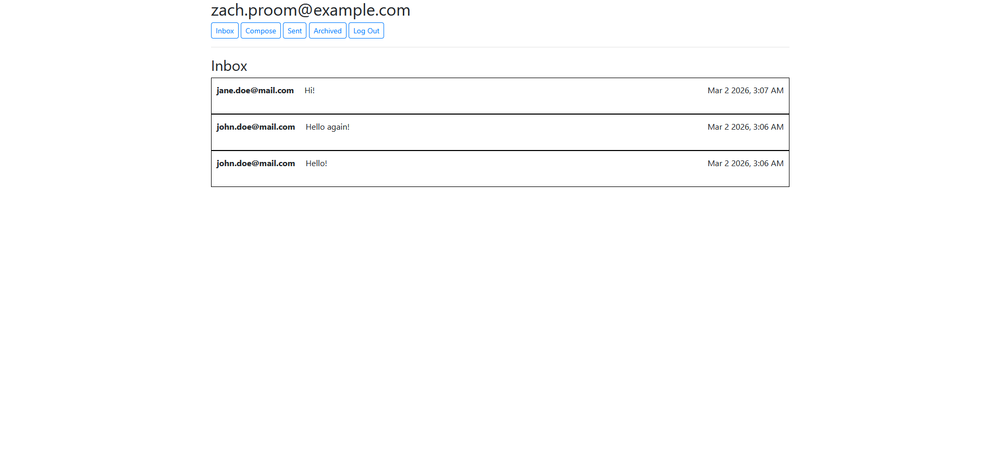

# Mail

## Overview

Mail is a client that enables users to send and receive emails. In addition to sending emails, users can reply to emails and archive emails. The app utilizes Python (Django framework) on the back-end. On the front-end, JavaScript lets users get mail, send mail, and update emails via the app's API. The emails are stored in the app's database. They are not sent to real email servers. 

This project was originally an assignment for an online class (Web Programming with Python and JavaScript, Harvard Extension School).

## How to run the app

The app is packaged as a Docker container so it can be run locally. Docker is the only prerequisite.

From the root folder of the repository, run the following commands:

```
docker build -t mail .
```

Once the image is built, start the container with:

```
docker run -p 8000:8000 mail
```

In addition to installing all the project dependencies, the Dockerfile creates the app database schema based on the code in `mail/models.py`.

The app will be available at: http://127.0.0.1:8000.

### Adding content to the site

You will notice that there are no emails or users.

Create one or more superusers who can create, edit, and delete any of the models in Mail by running:

1. If the container is not running: `docker start <container-name-or-id>` (you can check the container information by running `docker ps --all`) 
2. `docker exec -it <container-name-or-id> python3 manage.py createsuperuser`

To use the admin app, go to the URL http://127.0.0.1:8000/admin/ and sign in with your superuser's credentials. The admin app offers a quick way to populate Mail with content.

You can also create regular users by signing out and clicking the Register here link on the login page.

Below is a screenshot of the admin interface.



## Technologies Used

- Backend: Python, Django
- Frontend: HTML/CSS, Bootstrap, vanilla JavaScript
- Database: SQLite for development (can be switched to PostgreSQL)
- Deployment/Dev: Docker, Gunicorn (production), Django development server

## Models

Mail includes the following models:
- User
- Email

The **User** model stores basic information about each user, such as their registration information (Django encrypts User passwords by default). This model inherits Django's AbstractUser class.

The **Email** model stores information about each email in the app. This includes the email's sender, recipient(s), body, and read/archived status. The Email model is used for both top-level emails and replies. 

## Templates

Mail comprises four HTML files, listed below.
- layout.html (layout inherited by each template)
- login.html (login page)
- register.html (new user registration page) 
- inbox.html

**inbox.html** is the page all where all other user actions are performed. Any time the user clicks a button to compose an email or view a different mailbox, they remain on this page. Rather than taking users to a new route when they click a button, the app uses JavaScript to control the interface. In this way, Mail behaves like a single page application.

When you log in to the app, you should see an inbox similar to the one below:

  
 
## Static Files

The **static** directory contains a JavaScript file and a CSS file.

- inbox.js
- styles.css

**script.js** creates a dynamic user interface for the app. In particular, it lets users compose new emails, reply to emails, and view different mailboxes using the app's API.

**styles.css** styles the app's templates. The app uses Bootstrap for additional styling (e.g. buttons).